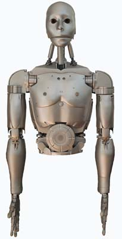

# robot-humanoide-casero
Software para robot humanoide casero (Phyton3 + Arduino C)
Basado en el diseño de Gael Langevin.

El software esta probado con Raspberry pi 4 y la resolución con la pantalla oficial tactil de raspberry pi.

